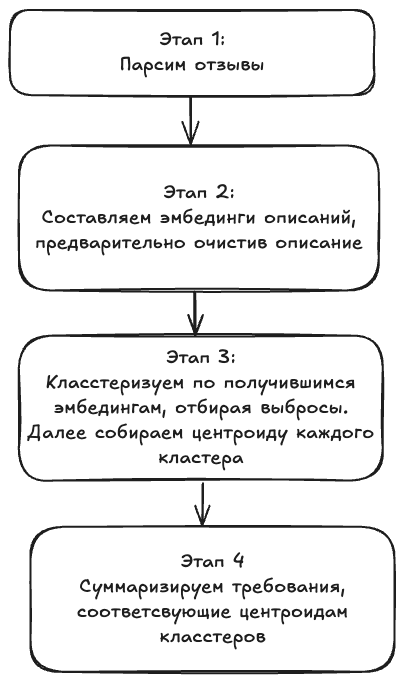

# Анализ вакансий hh.ru

## Описание проекта

Этот проект представляет собой инструмент для анализа вакансий с сайта hh.ru. Он позволяет выявлять ключевые навыки и условия, которые чаще всего встречаются в объявлениях, и формировать общее представление о требованиях работодателей.

Цели проекта:

- Сбор и парсинг данных с hh.ru.
- Выделение и агрегирование требований к кандидатам.
- Создание краткой выжимки ключевых навыков с использованием моделей `Vikhr-Llama-3.2-1B-Instruct` и `jinaai/jina-embeddings-v3`.

## Структура проекта

```plaintext
├── Dockerfile                    
├── LICENSE                       
├── README.md                     
├── app.py                         
├── docker-compose.yml             
├── images/                        
│   └── architecture.png           
├── requirements.txt               
├── scripts/                       
│   └── load_models.sh             
├── tests/                         
│   ├── __init__.py               
│   ├── conftest.py                
│   ├── test_parsing.py            
│   └── test_processing.py         
└── utils/                         
    ├── __init__.py                
    ├── parsing.py                 
    ├── processing.py             
    └── summarization.py           
```

## Схема суммаризации

Схема архитектуры иллюстрирует процесс сбора данных, их парсинг, обработку и суммаризацию, а также использования NLP моделей для анализа вакансий.



## Установка

1. Клонируйте репозиторий:

```bash
git clone https://github.com/notaskynet/HeadHunterAnalyser.git
cd HeadHunterAnalyser
```

2. Установите и загрузите необходимые модели

Перед тем как запустить проект, необходимо загрузить необходимые веса для моделей. Для этого выполните:

```bash
chmod +x scripts/load_models.sh && ./load_models.sh
```

3. Запустите проект с помощью Docker Compose:

Проект можно запустить с помощью Docker Compose. Это автоматически установит все зависимости и настроит окружение.

```bash
sudo docker-compose up --build
```

## Тестирование

Для тестирования используйте `pytest`:

```bash
pytest tests/
```

Тесты проверяют корректность работы парсинга и обработки данных.
